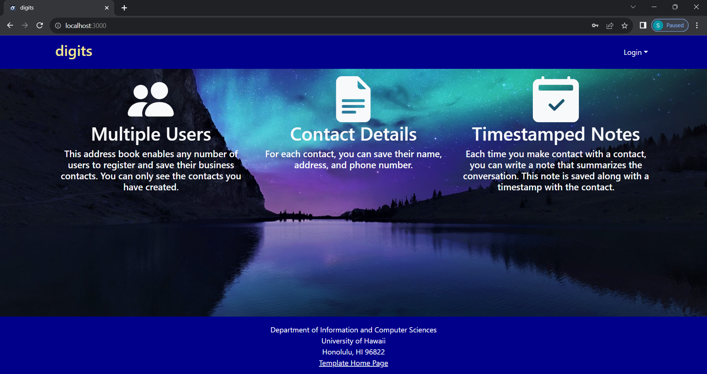
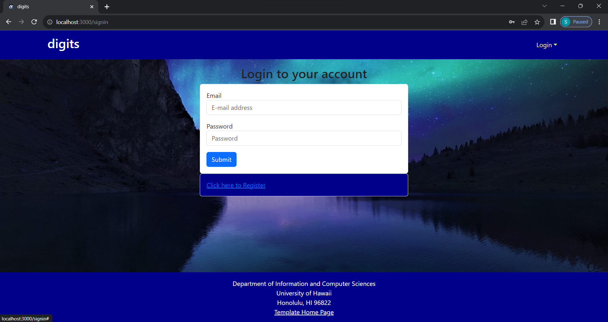
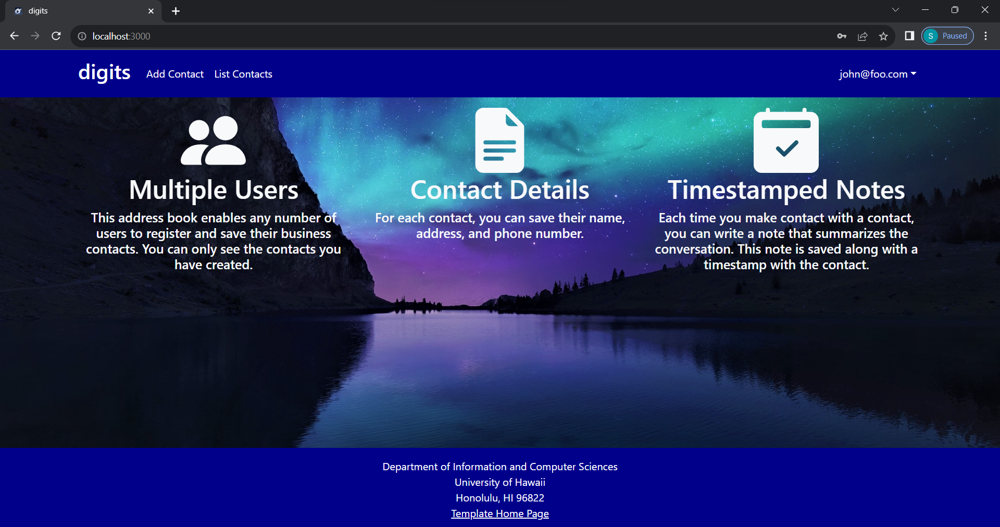
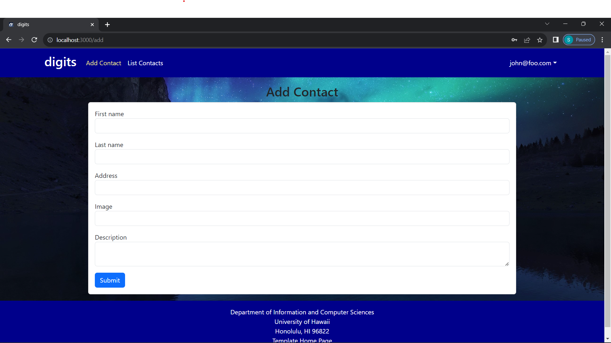
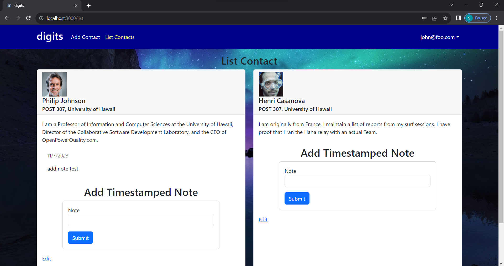
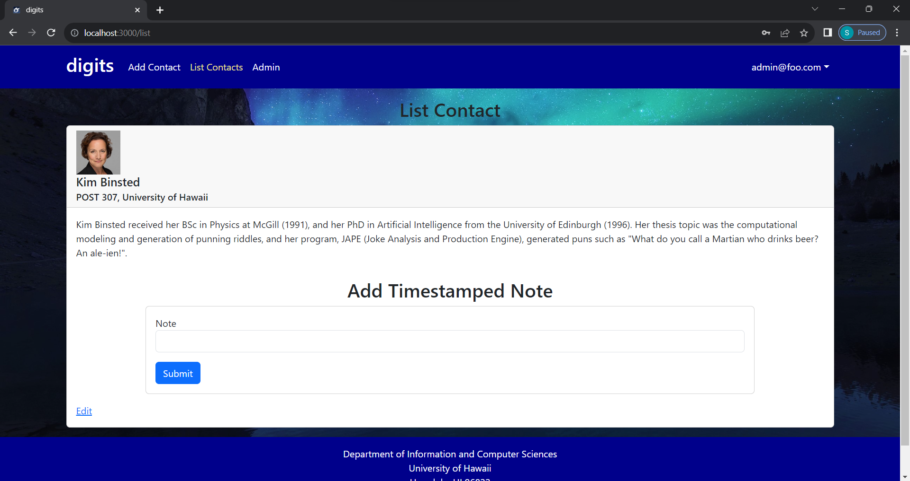
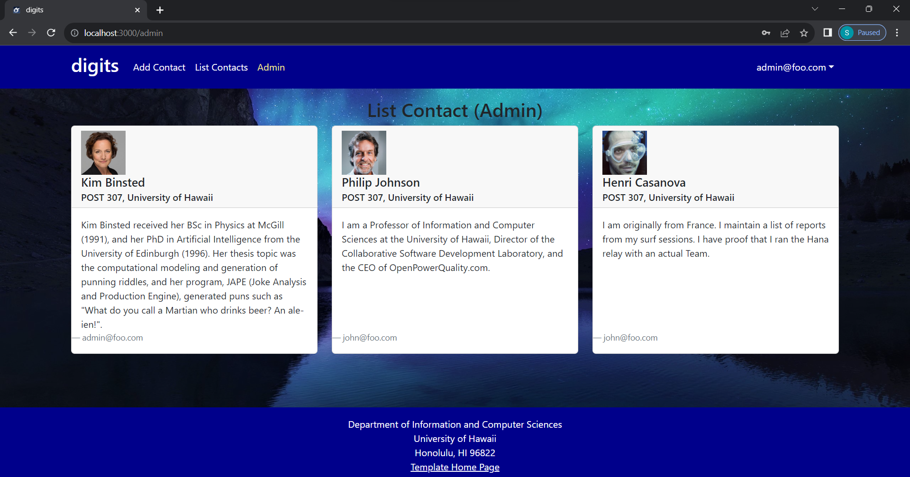
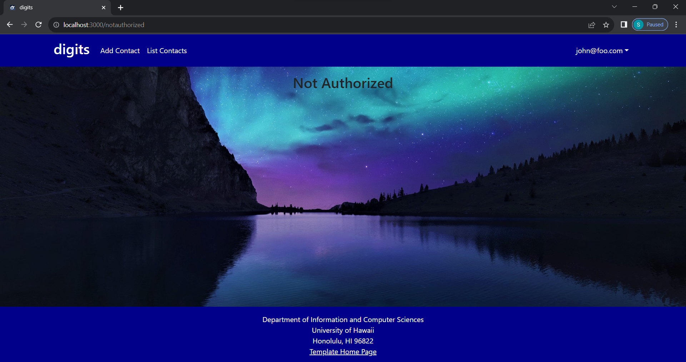

# Digits

## Landing Page

The Landing page has the overview of the web app capabilities and a login section in the navbar.
Pressing the 'Login' dropdown will prompt the user with a 'Sign In' and a 'Sign Up'.

## Sign in
Once 'Sign In' is pressed, the user will be taken to the 'Sign In' page where user can sign in.

## Sign Up
'Sign Up' is also available.

Entering a user and a password will allow the user to use the created login to sign in

## Landing Page after login
After Login (on non-admin login) the navbar will have 'Add Contact' and 'List Contacts'.

## Add Contact
On the 'Add Contact' page, users will see a form to input all the necessary values for a new Contact to be listed on the 'List Contacts' page for the user that is logged in to.

## List Contacts
On the 'List Contacts' page, users will see Cards of the Contacts 

## Admin Landing Page
In addition to the navbar on the non-admin landing page, there will be an 'Admin' page access.

## Admin List Contacts
The admin 'List Contacts' page will have the contacts created with the admin login.

## Admin Page
The additional 'Admin' page will display all contact cards.

Note: If trying to access this page by localhost:3000/admin from a non-admin login, the 'Not Authorized' page will be displayed.

